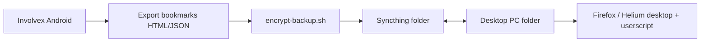

# Sync Without Cloud Servers

Chrome Sync is unavailable in de-Googled Chromium forks. Involvex uses **local
export + peer sync** — no server you operate, no subscription cost.

## Built-in browser features

| Data | Export | Import | Patch |
|------|--------|--------|-------|
| Bookmarks | Settings → Bookmarks → Export | Import | Vanadium `0277` |
| Passwords | Settings → Passwords → Export | Import | Local login DB (`0271`–`0275`) |
| History | Manual / future patch | — | Not in Vanadium today |

## Recommended: Syncthing + encrypted backup



### Step 1 — Export on Android

1. Involvex → Bookmarks → **Export bookmarks**
2. Save to `Download/involvex-bookmarks.html`
3. (Optional) Export passwords to encrypted CSV from password settings

### Step 2 — Encrypt for transit

Use the helper script (AES-256-CBC, compatible with OpenSSL):

```bash
# On phone (Termux) or PC after adb pull
bash scripts/encrypt-backup.sh encrypt involvex-bookmarks.html involvex-bookmarks.enc
# Decrypt on other device
bash scripts/encrypt-backup.sh decrypt involvex-bookmarks.enc restored.html
```

Set passphrase via environment variable:

```bash
export INVOLVEX_BACKUP_KEY="your-long-passphrase"
```

### Step 3 — Syncthing folder

1. Install [Syncthing](https://syncthing.net/) on Android and PC
2. Create shared folder `involvex-sync` (read-write both sides)
3. Place `*.enc` backup files in that folder
4. Syncthing syncs device-to-device — **no cloud server**

### Step 4 — Import on other device

- **Android:** Bookmarks → Import → select decrypted HTML
- **Desktop Firefox:** Bookmarks → Import → HTML file
- **Desktop Helium/Chromium:** same import path as Android

## Desktop userscript / Tampermonkey workflow

For users who prefer a browser extension over Syncthing UI:

1. Export bookmarks from Involvex to `involvex-bookmarks.html`
2. Place in a synced folder (Syncthing, Nextcloud self-hosted, USB)
3. Tampermonkey script on desktop watches folder or manual import trigger

Example stub (desktop Firefox + Greasemonkey/Tampermonkey):

```javascript
// ==UserScript==
// @name         Involvex Bookmark Import Helper
// @match        about:blank
// @grant        none
// ==/UserScript==
// Manual: user selects exported HTML; script parses and offers import links.
// Full implementation: use File System Access API where available.
```

## QR one-time transfer

For small configs (search engines, extension lists), use QR payload export —
pattern borrowed from Involvex WebView prototype (`QrScannerScreen`).

## What not to use

| Method | Why avoid |
|--------|-----------|
| Kiwi Sync | Firebase backend — conflicts with no-cloud goal |
| Chrome Sync | Disabled / Google-blocked for third-party browsers |
| GitHub Gist (Involvex prototype) | Third-party cloud; OK for dev, not primary sync |

## Future work

- [ ] History export patch (Chromium `history_exporter`)
- [ ] Scheduled auto-export to Syncthing-watched directory
- [ ] Import on startup when `involvex-sync/import.pending` flag set
